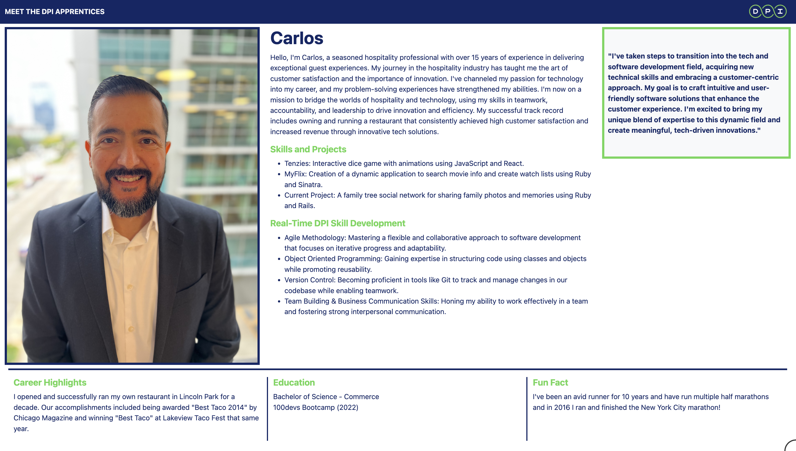
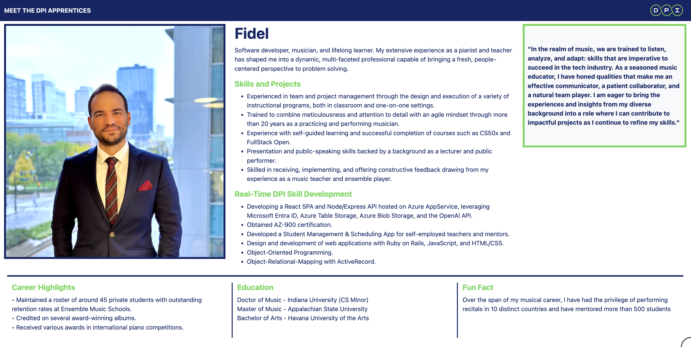
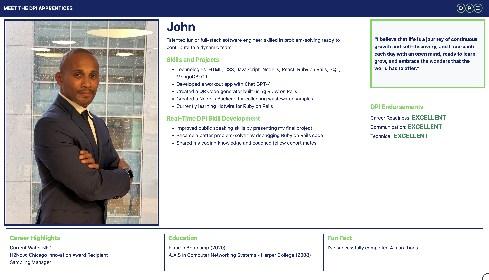
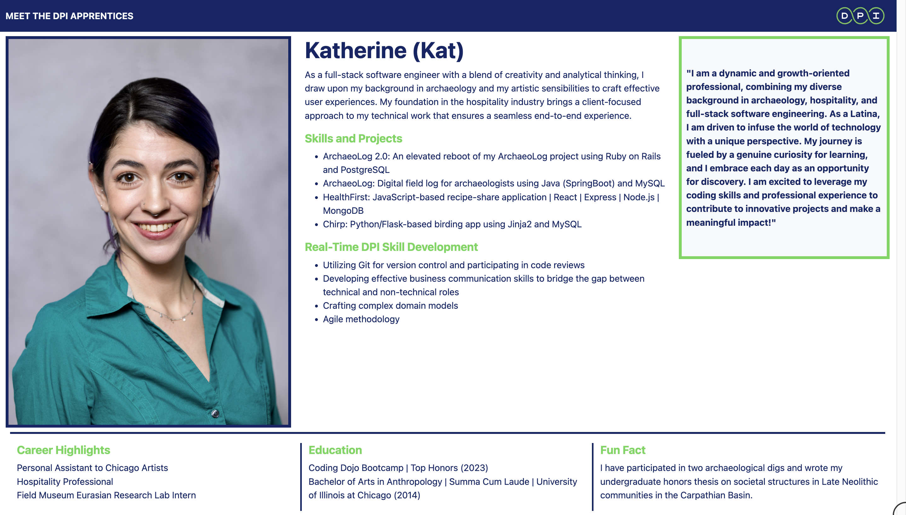
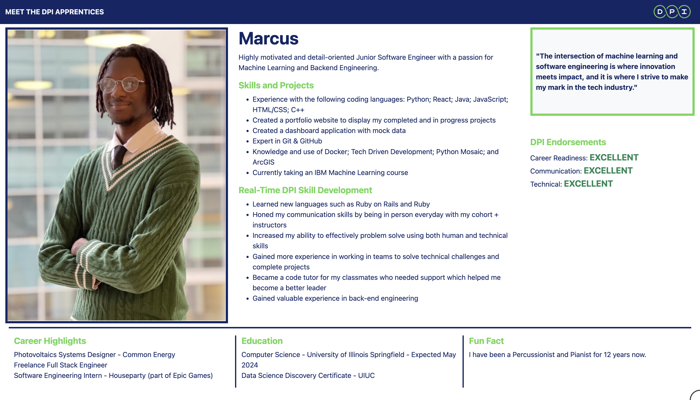
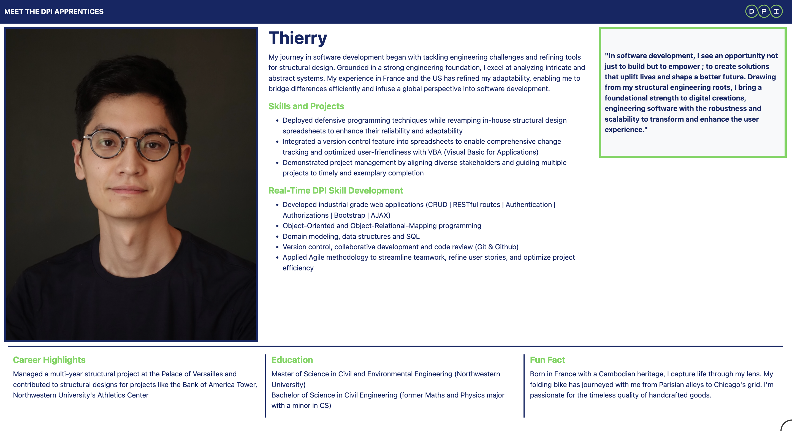
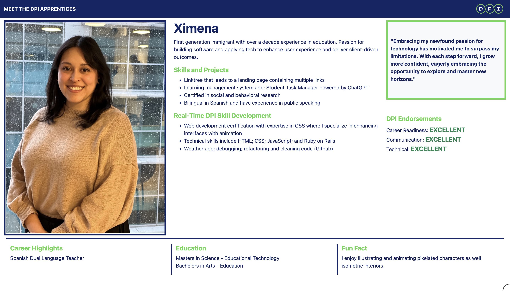

# Setup Your Internal Profile
In this lesson, you will learn how to set up and manage your internal profile on our platform. This profile is crucial for showcasing your skills, projects, and experiences to potential employers. A well-crafted profile can significantly enhance your job prospects and professional image.

## What Employers See
Your internal profile is often the first impression employers will have of you. It should effectively communicate your skills, projects, career highlights, and educational background. Employers are looking for candidates who not only have the technical skills but also demonstrate initiative, problem-solving abilities, and a passion for their field.

## What You Need to Include
### Introduction

Write a 1-2 sentence introduction that draws the reader in. This should be engaging and give a quick overview of who you are and what you bring to the table.

### Skills and Projects

- **Skills**: List both technical and non-technical skills. Focus on skills that are relevant to the job you want and are desirable to employers.
- **Projects**: Include projects you worked on during the intro course or any relevant projects from the past. Describe what you did, the technologies used, and the outcomes.

### Real-Time DPI Skill Development

This section will be continuously updated throughout your training. For now, include skills you gained in the intro course and during your first few weeks in person.

### Career Highlights

Highlight something special you accomplished in a previous role. This could be a project you led, a significant achievement, or a notable contribution. Be concise, as space is limited.

### Education

Include your most advanced level of education. This can be degrees, certificates, or bootcamps.

### Fun Fact

Share something interesting about yourself. This helps the reader get to know you on a more personal level.

### Quote

Include a quote that reflects why you are on this journey and your passion for working in technology.

## Steps to Update Your Profile

### Login to the Dashboard:

Go to [https://dashboard.dpi.dev](https://dashboard.dpi.dev).
If this is your first time logging in, select the "Forgot my password" link, enter your Canvas email, and look for an email verification and sign-in link to set a new password. Check your spam folder if you don't find it in your Inbox.

### Update Your Profile

In the dashboard, navigate to the profile update section.
Fill in the required fields: Introduction, Skills and Projects, Real-Time DPI Skill Development, Career Highlights, Education, Fun Fact, and Quote.
Make sure all information is accurate and up-to-date.

### Submit Your Snapshot URL

Once your profile is updated, submit your snapshot URL.
Review your snapshot to ensure it accurately reflects your skills and experience. Remember, we share these snapshots with employers, so make sure it presents you in the best light.

## Examples from Previous Cohorts
Here are some examples from previous cohorts to help guide you:

## Quiz
- Why is it important to have a well-crafted internal profile?
- It helps you keep track of your progress.
  - Not quite. While it does help with progress tracking, its primary purpose is to showcase your skills to employers.
- It enhances your job prospects by showcasing your skills and experiences to potential employers.
  - Correct! A well-crafted profile can significantly improve your chances of getting hired.
- It is a requirement of the training program.
  - Not quite. Though it is encouraged, the main goal is to benefit your professional development.
{: .choose_best #importance title="Importance of Internal Profile" points="1" answer="2"}

- What should be included in the Career Highlights section of your profile?
- A list of all your previous jobs.
  - Not quite. Focus on significant accomplishments rather than listing all jobs.
- A special accomplishment in a previous role.
  - Correct! Highlight something notable you achieved in a previous role.
- A detailed description of your daily tasks.
  - Not correct. Highlighting accomplishments is more impactful than detailing daily tasks.
{: .choose_best #career_highlights title="Career Highlights" points="1" answer="2"}

- Including a fun fact in your profile helps potential employers get to know you better.
- True
  - Correct! Sharing a fun fact adds a personal touch to your profile.
- False
  - Not correct. A fun fact can help make you more relatable and memorable.
{: .choose_best #fun_fact title="Fun Fact" points="1" answer="1"}

## Follow Up Assignment
Update your profile in the dashboard and submit your snapshot URL. This will confirm that you have successfully set up your internal profile.
